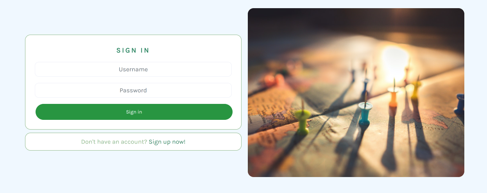
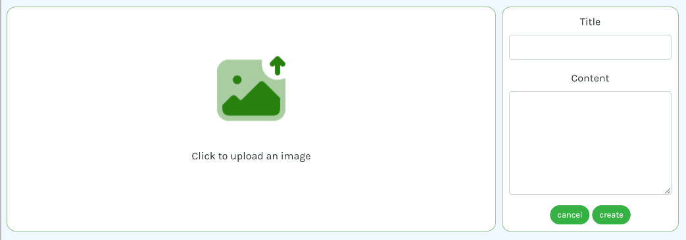
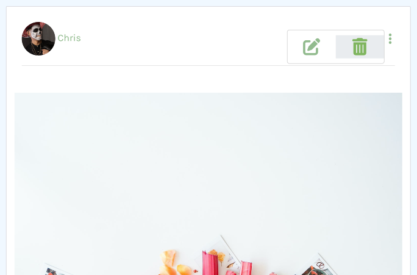
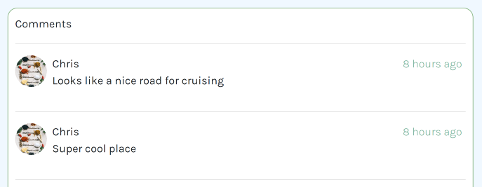
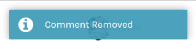
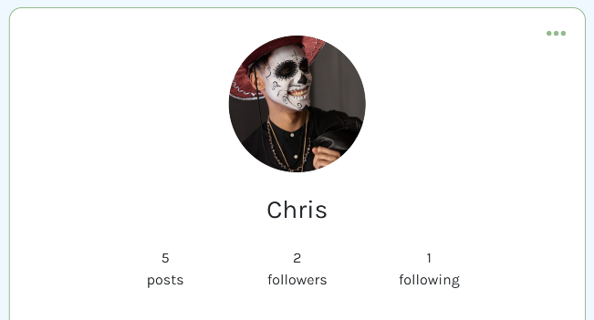

# **_Where Next - Your Travel & Social Media Site_**

Where Next is a full-stack project, created using JavaScript, CSS & HTML and built on the React front-end framework. The project's primary objective is to deliver a highly functional and responsive website that empowers users to create and share their posts effortlessly. Through its comprehensive CRUD functionality, users can easily modify and delete their posts as needed. Furthermore, each post page features a dynamic comments section and intuitive options to like and bookmark posts for later reference. The platform also allows users to form groups and gives users the opportunity to join/leave, as well as follow and unfollow each other, facilitating a seamless and enjoyable experience. Moreover, the website is carefully designed with UX principles in mind, ensuring its accessibility and intuitive navigation. This, in turn, enhances user satisfaction and enables users to effortlessly discover the information and resources they need.

The live link can be found [**here**](https://where-next-social.herokuapp.com/)

To view the backend *API repository*, please click [**here**](https://github.com/chris-townsend/drf-api-where-next)

 

*Please note: To open any external links in a new browser tab, please press **CTRL + Click***

# 

## Contents

- [Where next](#where-next)
  * [User Experience (UX)](#user-experience-ux)
    + [Epics](#epics)
    + [User Stories](#user-stories)
      - [Future Stories](#user-stories-not-yet-implemented)
    + [Design](#design)
      - [Wireframes](#wireframes)
      - [Colour Scheme](#colour-scheme)
      - [Imagery](#imagery)
      - [Typography](#typography)
  * [Agile Methodology](#agile-methodology)
  * [Data Model](#data-model)
  * [Security Features](#security-features-and-defensive-design)
    + [User Authentication](#user-authentication)
    + [Form Validation](#form-validation)
    + [Database Security](#database-security)
  * [Features](#features)
    - [Features Left to Implement](#future-features)
  * [Re-use of Components](#components) 
  * [Hooks](#hooks) 
    - [Languages Used](#languages-used)
  - [Technologies Used](#programs-frameworks--libraries-used)
    - [Programs](#programs)
    - [Frameworks](#frameworks)
    - [Libraries](#libraries)
  * [Testing](#testing)
  - [Development](#development)
    - [GitHub](#github)
    - [React](#react)
  * [Deployment](#deployment)
    - [Heroku](#heroku)
    - [Forking the GitHub Repository](#forking-the-github-repository)
    - [Making a local clone](#cloning-this-repository)
  * [Credits](#credits)
    + [Content](#content)
    + [Media](#media)
  * [Acknowledgements](#acknowledgements)

***

## User Experience (UX)

Where Next is a social media app designed for individuals who are passionate about traveling and exploring new destinations. As an active and tech-savvy audience, users are looking for a platform that caters specifically to their travel interests. With Where Next, users can join a vibrant community of like-minded individuals to share their travel experiences, connect with others, and gain inspiration for their next adventure. Whether creating captivating posts, bookmarking favorite destinations, or editing their profiles, users can curate and showcase their travels in a dynamic and engaging way. Ultimately, Where Next provides an immersive and interactive space where travel enthusiasts can come together to explore the world.

### Epics 

6 Epics were created as Milestones which were then further developed into 35 User Stories. The details on each epic, along with the user stories linked to each one can be found [here](https://github.com/chris-townsend/where-next/milestones).

[EPIC 1](https://github.com/chris-townsend/where-next/milestone/1) **Navigation**

[EPIC 2](https://github.com/chris-townsend/where-next/milestone/2) **User Account Management**

[EPIC 3](https://github.com/chris-townsend/where-next/milestone/3) **Posts**

[EPIC 4](https://github.com/chris-townsend/where-next/milestone/4) **Comments**

[EPIC 5](https://github.com/chris-townsend/where-next/milestone/6) **Features**

[EPIC 6](https://github.com/chris-townsend/where-next/milestone/7) **Groups**

#

### User Stories
#

#### EPIC | **Navigation**

[#1](https://github.com/chris-townsend/where-next/issues/1) - *As a **User**, I can **access a navigation bar on every page** so that **I can easily view desired content***

[#29](https://github.com/chris-townsend/where-next/issues/29) - *As a **User**, I would like to **use the app on my mobile**, so that **I don't have to rely on having my laptop/desktop with me***

#

#### EPIC | **User Account Mangement**

[#2](https://github.com/chris-townsend/where-next/issues/2) - *As a **User**, I can **register for an account** so that **I can gain access to all the features that are available exclusively to registered users***

[#3](https://github.com/chris-townsend/where-next/issues/3) - *As a **User,** I can **register for an account by using one of my social media accounts** so that **I can use an alternative method of signing up***

[#6](https://github.com/chris-townsend/where-next/issues/6) - *As a **User**, I can **log into my account** so that **I can access functionality for logged in users***

[#7](https://github.com/chris-townsend/where-next/issues/7) - *As a **User**, I can **safely log out of my account** so that **I can disconnect from the site***

[#8](https://github.com/chris-townsend/where-next/issues/8) - *As a **logged-in User**, I can **see my login status** so that **I know if I am logged in or out of my account***

[#10](https://github.com/chris-townsend/where-next/issues/10) - *As a **logged-in User**, I would like **the option to delete my account** so that **I can remove myself from the app.***

[#11](https://github.com/chris-townsend/where-next/issues/11) - *As a **logged-in User**, I can **change my password** so that **I can keep my account secure***

#

#### EPIC | Posts

[#4](https://github.com/chris-townsend/where-next/issues/4) - *As a **User**, I can **view posts**, without **having to sign-up to enjoy the site's content***

[#5](https://github.com/chris-townsend/where-next/issues/5) - *As a **logged-in User**, I can **create posts** so that **I can add content to the site***

[#12](https://github.com/chris-townsend/where-next/issues/12) - *As a **logged-in User**, I can edit my post so that I can fix or update my existing content*

[#13](https://github.com/chris-townsend/where-next/issues/13) - As a **logged in User**, I would like the **ability to delete posts** so that I can **remove any post that I don't want to share**

[#20](https://github.com/chris-townsend/where-next/issues/20) - As a **logged-in User**, I want to **express my appreciation for posts that interest me by liking them**, so that I can **engage with the content and show support for the author**

[#25](https://github.com/chris-townsend/where-next/issues/25) - *As a **User**, I would like to **see the newest posts at the top, ordered by most recently created** so that I am **up to date with the latest content***

#

#### EPIC | Comments

[#9](https://github.com/chris-townsend/where-next/issues/9) - *As a **User**, I can **view comments on posts** so that **I can read other user's feedback***

[#18](https://github.com/chris-townsend/where-next/issues/18) - *As a **logged-in User**, I want to be able to **leave comments on a post**, so that I can **express my opinions or ideas related to the post***

[#22](https://github.com/chris-townsend/where-next/issues/22) - *As a **logged-in User** who is the **owner of the comment**, I can **update my comment** so that I can **fix any mistakes***

[#23](https://github.com/chris-townsend/where-next/issues/23) - *As a **logged-in User** who is the **owner of the comment**, I can **delete my comment** so that I can **remove any unwanted comments from the site***

[#27](https://github.com/chris-townsend/where-next/issues/27) - *As a **User**, I can **see the date of when the comment has been published** so that I know **how old the comment is***

#

#### EPIC | Features

[#14](https://github.com/chris-townsend/where-next/issues/14) - *As a **User**, I can **view other user's profiles** so that I can **see their bio and learn more about them***

[#15](https://github.com/chris-townsend/where-next/issues/15) - *As a **logged-in User**, I can **customise my profile with an avatar** so that my profile is **easy to identify within the site***

[#16](https://github.com/chris-townsend/where-next/issues/16) - *As a **logged-in User**, I would like the ability to **update my profile** so that I can **keep my information up to date***

[#17](https://github.com/chris-townsend/where-next/issues/17) - *As a **logged-in User**, I would like the ability to **follow/unfollow users** so I can **keep track of their content and revisit their profiles easily***

[#19](https://github.com/chris-townsend/where-next/issues/19) - *As a **logged-in User**, I can **save a post to a personal list** so that I can **easily return to it later***

[#21](https://github.com/chris-townsend/where-next/issues/21) - *As a **User**, I can **search for posts or profiles by keyword** so that I can **find what I'm looking for more efficiently***

[#24](https://github.com/chris-townsend/where-next/issues/24) - *As a **User**, I would like the ability to **print a post** so that **I can have a paper copy of the information I require***

[#26](https://github.com/chris-townsend/where-next/issues/26) - *As a **User**, I can keep **scrolling through my feed of posts which load automatically**, so that **I don't have to change pages***

[#28](https://github.com/chris-townsend/where-next/issues/28) - *As a **User**, I can **contact the site owner** so that **I can request any information that I might need***

[#30](https://github.com/chris-townsend/where-next/issues/30) - *As a **Site owner**, I can **add a favicon** so that **the site looks more distinguishable***

#

#### EPIC | Groups

[#42](https://github.com/chris-townsend/where-next/issues/42) - *As a **logged-in User**, I want to **be able to create a new group** so that **I can connect with people who share my interests and plan trips together***

[#43](https://github.com/chris-townsend/where-next/issues/43) - *As a **logged-in User**, I want to **be able to delete a group if it no longer aligns with my interests or travel plans** so that **I can focus on other groups that better suit my needs***

[#41](https://github.com/chris-townsend/where-next/issues/41) - *As a **logged-in User**, I want to be able to **see a list of members in a group** so that **I can get to know other people and connect with them***

#

#### User stories not yet implemented

The following user stories were scoped out of the project due to time constraints and its intended that these user stories will be implemented at a later date. 

[#3](https://github.com/chris-townsend/where-next/issues/3) - *As a **User,** I can **register for an account by using one of my social media accounts** so that **I can use an alternative method of signing up***

[#10](https://github.com/chris-townsend/where-next/issues/10) - *As a **logged-in User**, I would like **the option to delete my account** so that **I can remove myself from the app.***

[#24](https://github.com/chris-townsend/where-next/issues/24) - *As a **User**, I would like the ability to **print a post** so that **I can have a paper copy of the information I require***

[#44](https://github.com/chris-townsend/where-next/issues/44) - *As a **logged-in User**, I want to **receive birthday alerts for my connections**, so that **I can send them a personalized birthday comment***

[Back to top ⇧](#where-next)

***

### Design

The website was designed with a minimalistic style to align with the site's objectives. The simple design allows users to easily navigate through the site and find what they are looking for.

***

#### Wireframes

Initial wireframes were created for the original ideas, and as functionality was scaled back, these wireframes have also served as guidelines for the more basic features that remain in place for future development. The wireframes were designed using Balsamiq.

*Please note - to view the wireframe images, you need to click on the arrow next to each title.*

#### ***Desktop***

 
Homepage <i>logged out</i>

 
Homepage <i>logged in</i>

 
Post Detail

 
Post Detail for the <i>owner</i>

 
Create post

 
Group List

 
Create Group

 
Group Detail

 
Contact Page

 
Profile

 
Profile for the <i>owner</i>

 
Change password

# 

#### ***Mobile***

 
Homepage <i>logged out</i>

Homepage <i>logged in</i>

 

***

#### Colour Scheme

I chose a light colour scheme to ensure that there is good contrast with the text and to create a clean and visually appealing look across the site. During the design process, I carefully considered how to establish a strong contrast between background colours and text while ensuring that the site meets accessibility requirements. This attention to detail is crucial in creating a positive user experience for all visitors to the site.

*Colour palette from* [*Coolors*](https://coolors.co/)

***

#### Imagery

The imagery used throughout the site is intended to inspire users to explore and share unique places, I have carefully selected imagery throughout my site, sourced from a combination of user uploads and reputable, royalty-free sites such as [Pexels](https://www.pexels.com/) and [Unsplash](https://unsplash.com/). While most of the images on the site are user-uploaded, the static images currently in use have been sourced from royalty-free sites to ensure quality and consistency. A comprehensive list of the royalty-free images used can be found in the credits section.

***

#### Typography 

I carefully selected the Karla and Roboto Flex fonts for my social media app, with the goal of creating an elegant and calming visual theme, while ensuring easy readability and consistency across multiple devices. Karla, a warm and friendly humanist sans-serif font with rounded terminals, was chosen for its high legibility, even at small sizes, making it ideal for body text. Roboto Flex, a versatile modern sans-serif font, was selected for its ability to adapt well to both headings and display text, giving the app a unique and cohesive look.

In case there are any issues with the primary font choices, a reliable backup font, Sans-serif, has been selected to ensure consistent styling throughout the app. By leveraging Google fonts, which can be imported through their API, I can maintain consistent styling and readability across different devices.

**Headings:** *'Roboto Flex' & 'Karla'*

**Body:** *'Karla'*

***

## Agile Methodology

GitHub projects were used to manage the development process using an agile approach. To view the project kanban board, please click on the link [here](https://github.com/users/chris-townsend/projects/7/views/1)

A GitHub Issue was created for each User Story, which was then allocated to a milestone (Epic). Each User Story has defined acceptance criteria to make it clear when the User Story has been completed. The acceptance criteria are further broken down into tasks to facilitate the User Story's execution. The issues were closed automatically when the pull request was linked to the issue, most of them were closed automatically but some were closed manually.

***

## Data Model

*Database schema from [drawSQL](https://drawsql.app/)*

## Security Features and Defensive Design

### User Authentication

### Form Validation

A warning message will appear to the user when inaccurate or empty data is entered into a form, identifying the specific field that caused the issue. This prevents the form from being submitted until the issue is resolved, ensuring that only accurate and complete data is processed.

### Database Security

[Back to top ⇧](#kitchen-tales)

***

## Features

### Header

**Logo**

- A customised logo was created using [Logo.com](https://logo.com/) which is a free logo generator.

- The logo is prominently positioned in the top-left corner of the navigation bar. It is linked to the homepage to make it easy for users to navigate back to the main page of the website.

**Navigation Bar**

- The navigation bar is present on all pages of the website and allows for easy navigation. The Navbar includes a logo and links to various pages. The links on the Navbar will change depending on whether the user is logged into their account or not.

#### *User is not logged in Navbar*

#### *User logged-in Navbar*

- If a user is logged in, their profile avatar will be displayed in the navigation bar and also a side navigation menu will appear. This menu provides a logged-in user with the ability to manage and save posts, create and join groups & sign out of their account.

### Home Page

### User Account Pages

**Sign Up**

**Sign In**

**Sign Out**

### Post Detail Page

**Post Action Buttons**

- On the post detail page, if the logged-in user is the owner of the post, they will have the option to edit or delete the post by the presence of a menu which consists of an edit and delete icon.

### Edit Post

### Add Post

### Delete Post

**Comments Section**

### Update Comment

### Delete Comment

### My Feed Page

- A user's feed will compose of posts which the user is following. The feed page has the same styling as Home, Bookmarks and Liked as it uses the Post component. The Infinite scroll component is used to continously display posts, allowing the user to not have to change page to view more posts.

### My Bookmarks Page

- The Bookmarks page displays a user's collection of bookmarked posts, easily identified by a bookmark icon on the post component. By simply clicking the bookmark icon, a post can be saved to the user's personal Bookmarks page. The layout of this page is consistent with the other post pages, with the added convenience of the Infinite scroll component so that users don't have to change pages to view more posts.

### Profile Page

### Edit Profile

### Change Username

### Change password

### Groups

**Create Group**

**Group Detail page**

### Contact Page

### Error Page

- ***404** Page Not Found* - The page you're trying to access doesn't exist.

***

### Future Features

In the future, there are several functionalities that I would like to implement. I have left the initial user stories that were created in the project kanban board as potential areas for future improvement and these have been left in the [Future Features](https://github.com/users/chris-townsend/projects/7/views/1) section of the kanban board. The key areas I would like to add to the site include:

- [#3](https://github.com/chris-townsend/where-next/issues/3) The ability for users to log in via social networks such as Facebook or Google.

- [#24](https://github.com/chris-townsend/where-next/issues/24) The option to print a post.

- [#10](https://github.com/chris-townsend/where-next/issues/10) The ability to delete my account.

- [#44](https://github.com/chris-townsend/where-next/issues/44) Birthday reminders for followed users.

***

## Components

### `Asset.js`

*Asset.js* is a versatile and reusable component that is used throughout my app to display a loading spinner in a visually appealing way. With customizable props such as spinner, src, and message, the component can be easily adapted to suit different use cases and design requirements. When the spinner prop is set to true, the component displays a rotating Earth animation to indicate that content is being loaded. When the src prop is present, the component displays an image with customizable alt text provided by the message prop. When the message prop is present, the component displays a paragraph of text below the image.

### `Avatar.js`

The *Avatar.js* component is designed to display user avatars with a high degree of flexibility and reusability. By separating the avatar display from other components and pages, it enables more efficient code organization and easier maintenance. With customizable height and an optional text overlay, the Avatar component can adapt to different page designs and layouts, allowing for seamless integration into different parts of the site. Additionally, by including a timestamp in the image source, the Avatar component ensures that the image is always up-to-date and reloaded from the server when necessary. This feature helps prevent the browser from caching outdated images and ultimately contributes to improved site performance.

### `PostDropdownBar.js`

*PostDropdownBar.js* is a reusable component that renders a dropdown bar with edit and delete options for posts. It is built using React and React Bootstrap components, and styled using CSS. The component consists of a custom DropdownMenu component that renders a menu icon *(fas fa-ellipsis-v)*, and a Bootstrap Dropdown component that contains the dropdown menu items. The menu items include an Edit post option and a Delete post option, each with an associated icon. The component is designed to be flexible and customizable, allowing to easily integrate it elsewhere and modify its behavior and appearance as needed. This component is being used within `Comment.js` to allow users to edit and delete their own comments.

### `ProfileDropdownBar.js` 

The *ProfileEditDropdown* component renders a dropdown bar that allows a user to edit their profile, including changing their username or password. It uses the React Router's useHistory hook to navigate to different pages when the user clicks on a dropdown item. The dropdown menu is aligned to the left using the drop prop from the React Bootstrap Dropdown component. The ProfileDropdown component is used to display the dropdown menu icon, which is a fas fa-ellipsis-h font awesome icon. An OverlayTrigger component is used to display the text **"Settings"** when the user hovers over the icon. The dropdown items include an option to edit the user's profile, change their username, or change their password. The Dropdown.Item components include icons to represent each option, such as a pencil icon for editing the profile or a key icon for changing the password. When the user clicks on a dropdown item, the history.push method is called to navigate to the corresponding page.

### `Post.js` 

The Post component receives several props that contain information about a post such as its id, owner, title, image, comments_count, likes_count, and more. The component also uses the useCurrentUser hook from a custom context called CurrentUserContext to retrieve the current user. The Post component renders a Bootstrap Card component that contains information about the post including its owner, title, image, and the number of comments, likes, and groups it has. It also renders the `Avatar.js` component and the `PostDropdownBar.js` component that is only displayed if the current user is the owner of the post and is viewing it on the post detail page. The Post component contains several functions that handle different events like deleting a post, editing a post, liking a post, unliking a post, bookmarking a post, and unbookmarking a post. These functions make API calls using axiosRes. When the user likes or unlikes a post or bookmarks or unbookmarks a post, the Post component updates the posts state by calling the setPosts function passed down as a prop to the component. It updates the likes_count, like_id, book mark_count, and bookmark_id properties of the post object in the posts state. This component is used to display posts on the *'Feed'*, *'Bookmarks'* and *'Liked'* pages.

### React Infinite Scroll component

React Infinite Scroll is used to load content continuously as the user scrolls down a webpage. This feature works by loading new content into the webpage when the user reaches the bottom of the page, without requiring the user to manually click a *Load More* button. In my app, the React Infinite Scroll feature is being used to display a list of posts, groups, and comments. When a user scrolls down the page, the application automatically loads new posts, groups, and comments from the server and displays them in the list. This means that the user can continue scrolling indefinitely and the application will keep loading new content as needed, without requiring the user to refresh the page or click a button to load more content. This feature provides a seamless user experience, as the user can easily browse through a large amount of content without interruptions or delays.

***

## Hooks

### `useOutsideClickToggle.js`

This custom hook allows you to toggle a component's state based on clicks outside of it. It is useful for things like menus or popovers that need to be dismissed when the user clicks outside of them. I am using this hook in my `NavigationBar.js` component to automatically close the Navbar.Toggle Bootstrap component for small screen sizes. When the user clicks on the menu, it toggles the expanded state using the setExpanded function. The expanded value is then used to conditionally render the menu items. When the user clicks outside of the menu, the `useOutsideClickToggle` hook automatically updates the expanded state to false, hiding the menu.

### `useRedirect.js`

The useRedirect hook is a custom React hook that uses the React Router and Axios libraries to handle navigation and API requests. Its primary function is to redirect the user based on their authentication status, ensuring that they are directed to the appropriate page based on whether they are logged in or out. When called, the hook sends a POST request to refresh the authentication token using the axios library. If the user is logged in, they will be redirected to the home page using the useHistory hook from the React Router library. If there is an error refreshing the token or the user is logged out, they will also be redirected to the home page. This hook streamlines navigation in my React app and simplifies the logic for handling authentication.

***

## Languages Used

  )

  

***

## Programs, Frameworks & Libraries Used

### Programs

[**Balsamiq**](https://balsamiq.com/) - Balsamiq was used to create the basic wireframes during the design process.

[**Pixlr**](https://pixlr.com/x/) - Pixlr was used to resize and change the format of my images.

[**Google DevTools**](https://developer.chrome.com/docs/devtools/) - Once the website was made to a basic deployment level, Google DevTools was used frequently

[**Git**](https://git-scm.com/) - Git was used for version control by utilizing the Gitpod terminal to commit to Git and Push to GitHub.

[**GitHub**](https://github.com/) - GitHub is used to store the project's code after being pushed from Git.

[**Heroku**](http://heroku.com/) - Heroku is a cloud platform that lets people build, deliver, monitor, and scale apps. It supports several programming languages. Heroku was used for the deployment of this project.

[**W3C Markup Validator**](https://validator.w3.org/) - 

[**Favicon Generator**](https://favicon.io/favicon-converter/) - This was used to create my favicon icon. 

[**JSHint Validator**](https://jshint.com/) - Jshint was used to validate the JavaScript code. It shows any warnings and errors within my code. 

[**Cloudinary**](https://imgpile.com/) - A cloud hosting website, used for hosting my images.

[**DrawSQL**](https://drawsql.app/) - DrawSQL is a database diagram tool which was used to visualize relationship diagrams for my databases.

***

### Frameworks

[**React**](https://react.dev/) - React allows you to build user interfaces out of individual pieces called components. React components are JavaScript functions.

***

### Libraries & NPM packages

[**React Bootstrap 4.6**](https://react-bootstrap-v4.netlify.app/) - React Bootstrap provides a popular framework for building responsive mobile-first sites with built-in CSS & Javascript libraries.

[**axios**](https://axios-http.com/docs/intro) - Axios is a promise-based HTTP Client for node.js and the browser.

[**jwt-decode**](https://jwt.io/) - Securely implement authentication with JSON Web Tokens.

[**react-datepicker**](https://www.npmjs.com/package/react-datepicker) - A simple and reusable Datepicker component used for my date of birth field in a profile.

[**react-dom**](https://legacy.reactjs.org/docs/react-dom.html) - React library for rendering components in the DOM.

[**react-infinite-scroll-component**](https://www.npmjs.com/package/react-infinite-scroll-component) - React component for implementing infinite scrolling.

[**react-notifications**](https://www.npmjs.com/package/react-notifications) - Library for displaying notifications.

[**react-router-dom**](https://www.npmjs.com/package/react-router-dom) - React Router is a JavaScript framework that enables the creation of single-page web or mobile apps that allow navigating without refreshing the page.

[**web-vitals**](https://www.npmjs.com/package/web-vitals) - Library for measuring web performance metrics.

***

# Testing

Testing and results can be found [here](/TESTING.md)

***

# Development

This site was made using [GitHub](#github) & [Gitpod](https://www.gitpod.io/). The site was further developed using [React](#react), a JavaScript front-end framework.

## GitHub

### Create the repository

1. Sign in to GitHub and click the *New* button at the top of the page.

*Alternatively:*

1. From your personal drop-down at the top right of the page, select *Your repositories*.

2. Select **New** next to the *search repository* feature.     

3. If your using a **template**, pick from the drop-down menu. For this project, I'll be using no template.               

4. Give the repository a name and description and then click **Create repository**.

The repository has now been created and is ready for editing through the Gitpod terminal.
 
***

[Back to top ⇧](#where-next)

## React

***

[Back to top ⇧](#where-next)

# Deployment

## Heroku

To deploy this page to Heroku from its GitHub repository, the following steps were taken:

### Create the Heroku App

1. Log in to [Heroku](https://dashboard.heroku.com/apps) or create an account.

2. On your Heroku dashboard, click the button labelled **New** in the top right corner and from the drop-down menu select **Create new app**.

3. Enter a **unique and meaningful app name** and **choose the region** which is best suited to your location.

- Click on the **Create app** button.

4. Select **Deploy** from the tabs at the top of the app page.

5. Select **Connect to GitHub** from the deployment methods. 

6. Search for the repository to connect to by name.

7. Click **Connect**. Your app should now be connected to your GitHub account.

 8. Select **Enable Automatic Deploys** for automatic deployments.

- If you would like to deploy manually, select **Deploy Branch**. If you manually deploy, you will need to re-deploy each time the repository is updated.

- For the first time deploying to Heroku, you may have to deploy manually but if you select automatic deploys it will update from then onwards.

14. Click **View** to view the deployed site.

***

### Forking the GitHub Repository

By forking the GitHub Repository you can make a copy of the original repository. You can view and/or make changes without affecting the original repository by using the following steps...

**1.** Log in to GitHub and locate the [GitHub Repository](https://github.com/) you would like to fork.

**2.** At the top of the Repository, just above the **Tabs**, locate the **Fork** Button and you should now have a copy of the repository in your account.

***

### Cloning this repository

**1.** Log in to GitHub and locate the [GitHub Repository](https://github.com/).

**2.** On the repository main page, click the drop-down menu called **Code**.

**3.** To clone the repository using HTTPS, copy the link.

**4.** Open Git Bash

**5.** Change the current working directory to the location where you want the cloned directory to be made.

**6.** Type `git clone`, and then paste the URL you copied in Step 3.

**7.** Press Enter. Your local clone will be created.

***

## Credits

### Content 

- [Django REST framework docs](https://www.django-rest-framework.org/)

- [React Bootstrap 4.6 docs](https://react-bootstrap-v4.netlify.app/)

- [Code Institute - *'Moments'* walkthrough project](https://github.com/Code-Institute-Solutions/moments)

- [-]()

#

### Media

- Photo by *-*:

- Photo by *-*: 

- Photo by *-*:

- Photo by *-*: 

***

## Acknowledgements

- I'd like to take a moment to thank my mentor **Gareth** for his help in fixing a bug with my `Post.js` component. His insights and guidance were incredibly valuable and I appreciate the time and effort he took to assist me.

 

[Back to top ⇧](#where-next)