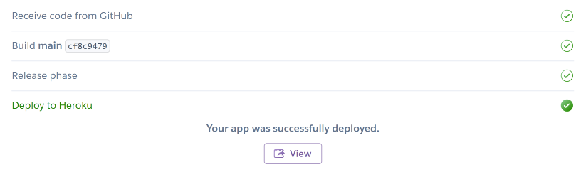

# Where next

Where Next is a full-stack project built using JavaScript and CSS. The goal is to create a functional and responsive website that enables users to create and share posts. The website will have full CRUD functionality, allowing users to edit and delete their posts. Each post page will have a comments section and options to like and bookmark posts to a bookmarks page. The website should follow UX design principles, and is accessible and easy to navigate, allowing users to find information and resources intuitively.

The live link can be found here - [Where next](https://where-next-social.herokuapp.com/)

*Please note: To open any external links in a new browser tab, please press **CTRL + Click***

## Contents

- [Where next](#where-next)
  * [User Experience (UX)](#user-experience-ux)
    + [Epics](#epics)
    + [User Stories](#user-stories)
      - [Future Stories](#user-stories-not-yet-implemented)
    + [Design](#design)
      - [Wireframes](#wireframes)
      - [Colour Scheme](#colour-scheme)
      - [Imagery](#imagery)
      - [Typography](#typography)
  * [Agile Methodology](#agile-methodology)
  * [Data Model](#data-model)
  * [Security Features](#security-features-and-defensive-design)
    + [User Authentication](#user-authentication)
    + [Form Validation](#form-validation)
    + [Database Security](#database-security)
  * [Features](#features)
    - [Features Left to Implement](#future-features)
    - [Languages Used](#languages-used)
  - [Technologies Used](#programs-frameworks--libraries-used)
    - [Programs](#programs)
    - [Frameworks](#frameworks)
    - [Libraries](#libraries)
  * [Testing](#testing)
  - [Development](#development)
    - [GitHub](#github)
    - [React](#react)
  * [Deployment](#deployment)
    - [Heroku](#heroku)
    - [ElephantSQL](#elephant-sql)
    - [Forking the GitHub Repository](#forking-the-github-repository)
    - [Making a local clone](#cloning-this-repository)
  * [Credits](#credits)
    + [Content](#content)
    + [Media](#media)
  * [Acknowledgements](#acknowledgements)

***

## User Experience (UX)

The target audience for Where next

### Epics 

6 Epics were created as Milestones which were then further developed into - User Stories. The details on each epic, along with the user stories linked to each one can be found [here](https://github.com/chris-townsend/where-next/milestones).

[EPIC 1](https://github.com/chris-townsend/where-next/milestone/1) **Navigation**

[EPIC 2](https://github.com/chris-townsend/where-next/milestone/2) **User Account Management**

[EPIC 3](https://github.com/chris-townsend/where-next/milestone/3) **Posts**

[EPIC 4](https://github.com/chris-townsend/where-next/milestone/4) **Comments**

[EPIC 5](https://github.com/chris-townsend/where-next/milestone/6) **Features**

[EPIC 6](https://github.com/chris-townsend/where-next/milestone/7) **Groups**

#

### User Stories
#

#### EPIC | **Navigation**

[#1](https://github.com/chris-townsend/where-next/issues/1) - *As a **User**, I can **access a navigation bar on every page** so that **I can easily view desired content***

[#29](https://github.com/chris-townsend/where-next/issues/29) - *As a **User**, I would like to **use the app on my mobile**, so that **I don't have to rely on having my laptop/desktop with me***

#

#### EPIC | **User Account Mangement**

[#2](https://github.com/chris-townsend/where-next/issues/2) - *As a **User**, I can **register for an account** so that **I can gain access to all the features that are available exclusively to registered users***

[#3](https://github.com/chris-townsend/where-next/issues/3) - *As a **User,** I can **register for an account by using one of my social media accounts** so that **I can use an alternative method of signing up***

[#6](https://github.com/chris-townsend/where-next/issues/6) - *As a **User**, I can **log into my account** so that **I can access functionality for logged in users***

[#7](https://github.com/chris-townsend/where-next/issues/7) - *As a **User**, I can **safely log out of my account** so that **I can disconnect from the site***

[#8](https://github.com/chris-townsend/where-next/issues/8) - *As a **logged-in User**, I can **see my login status** so that **I know if I am logged in or out of my account***

[#10](https://github.com/chris-townsend/where-next/issues/10) - *As a **logged-in User**, I would like **the option to delete my account** so that **I can remove myself from the app.***

[#11](https://github.com/chris-townsend/where-next/issues/11) - *As a **logged-in User**, I can **change my password** so that **I can keep my account secure***

#

#### EPIC | Posts

[#4](https://github.com/chris-townsend/where-next/issues/4) - *As a **User**, I can **view posts**, without **having to sign-up to enjoy the site's content***

[#5](https://github.com/chris-townsend/where-next/issues/5) - *As a **logged-in User**, I can **create posts** so that **I can add content to the site***

[#12](https://github.com/chris-townsend/where-next/issues/12) - *As a **logged-in User**, I can edit my post so that I can fix or update my existing content*

[#13](https://github.com/chris-townsend/where-next/issues/13) - As a **logged in User**, I would like the **ability to delete posts** so that I can **remove any post that I don't want to share**

[#20](https://github.com/chris-townsend/where-next/issues/20) - As a **logged-in User**, I want to **express my appreciation for posts that interest me by liking them**, so that I can **engage with the content and show support for the author**

[#25](https://github.com/chris-townsend/where-next/issues/25) - *As a **User**, I would like to **see the newest posts at the top, ordered by most recently created** so that I am **up to date with the latest content***

#

#### EPIC | Comments

[#9](https://github.com/chris-townsend/where-next/issues/9) - *As a **User**, I can **view comments on posts** so that **I can read other user's feedback***

[#18](https://github.com/chris-townsend/where-next/issues/18) - *As a **logged-in User**, I want to be able to **leave comments on a post**, so that I can **express my opinions or ideas related to the post***

[#22](https://github.com/chris-townsend/where-next/issues/22) - *As a **logged-in User** who is the **owner of the comment**, I can **update my comment** so that I can **fix any mistakes***

[#23](https://github.com/chris-townsend/where-next/issues/23) - *As a **logged-in User** who is the **owner of the comment**, I can **delete my comment** so that I can **remove any unwanted comments from the site***

[#27](https://github.com/chris-townsend/where-next/issues/27) - *As a **User**, I can **see the date of when the comment has been published** so that I know **how old the comment is***

#

#### EPIC | Features

[#14](https://github.com/chris-townsend/where-next/issues/14) - *As a **User**, I can **view other user's profiles** so that I can **see their bio and learn more about them***

[#15](https://github.com/chris-townsend/where-next/issues/15) - *As a **logged-in User**, I can **customise my profile with an avatar** so that my profile is **easy to identify within the site***

[#16](https://github.com/chris-townsend/where-next/issues/16) - *As a **logged-in User**, I would like the ability to **update my profile** so that I can **keep my information up to date***

[#17](https://github.com/chris-townsend/where-next/issues/17) - *As a **logged-in User**, I would like the ability to **follow/unfollow users** so I can **keep track of their content and revisit their profiles easily***

[#19](https://github.com/chris-townsend/where-next/issues/19) - *As a **logged-in User**, I can **save a post to a personal list** so that I can **easily return to it later***

[#21](https://github.com/chris-townsend/where-next/issues/21) - *As a **User**, I can **search for posts or profiles by keyword** so that I can **find what I'm looking for more efficiently***

[#24](https://github.com/chris-townsend/where-next/issues/24) - *As a **User**, I would like the ability to **print a post** so that **I can have a paper copy of the information I require***

[#26](https://github.com/chris-townsend/where-next/issues/26) - *As a **User**, I can keep **scrolling through my feed of posts which load automatically**, so that **I don't have to change pages***

[#28](https://github.com/chris-townsend/where-next/issues/28) - *As a **User**, I can **contact the site owner** so that **I can request any information that I might need***

[#30](https://github.com/chris-townsend/where-next/issues/30) - *As a **Site owner**, I can **add a favicon** so that **the site looks more distinguishable***

#

#### EPIC | Groups

[#42](https://github.com/chris-townsend/where-next/issues/42) - *As a **logged-in User**, I want to **be able to create a new group** so that **I can connect with people who share my interests and plan trips together***

[#43](https://github.com/chris-townsend/where-next/issues/43) - *As a **logged-in User**, I want to **be able to delete a group if it no longer aligns with my interests or travel plans** so that **I can focus on other groups that better suit my needs***

[#41](https://github.com/chris-townsend/where-next/issues/41) - *As a **logged-in User**, I want to be able to **see a list of members in a group** so that **I can get to know other people and connect with them***

#

#### User stories not yet implemented

The following user stories were scoped out of the project due to time constraints and its intended that these user stories will be implemented at a later date. 

[#3](https://github.com/chris-townsend/where-next/issues/3) - *As a **User,** I can **register for an account by using one of my social media accounts** so that **I can use an alternative method of signing up***

[#10](https://github.com/chris-townsend/where-next/issues/10) - *As a **logged-in User**, I would like **the option to delete my account** so that **I can remove myself from the app.***

[#24](https://github.com/chris-townsend/where-next/issues/24) - *As a **User**, I would like the ability to **print a post** so that **I can have a paper copy of the information I require***

[#44](https://github.com/chris-townsend/where-next/issues/44) - *As a **logged-in User**, I want to **receive birthday alerts for my connections**, so that **I can send them a personalized birthday comment***

[Back to top ⇧](#where-next)

***

### Design

The website was designed with a minimalistic style to align with the site's objectives. The simple design allows users to easily navigate through the site and find what they are looking for.

***

#### Wireframes

Initial wireframes were created for the original ideas, and as functionality was scaled back, these wireframes have also served as guidelines for the more basic features that remain in place for future development. The wireframes were designed using Balsamiq, with a mobile-first approach in mind.

*Please note that to view the wireframe images, you need to click on the arrow next to each title.*

#### ***Mobile***

 
Homepage

 
Feed

 
Liked Posts

 
Post Detail for the <i>author</i>

 
Post Detail for the <i>comment author</i>

 
My Bookmarked Posts

 
Add Post

 
Update Post

 
Delete Post

 
Search Post

# 

#### ***Desktop***

 
Homepage

Post Detail

 

***

#### Colour Scheme

I chose a light colour scheme to ensure that there is good contrast with the text and to create a clean and visually appealing look across the site. During the design process, I carefully considered how to establish a strong contrast between background colours and text while ensuring that the site meets accessibility requirements. This attention to detail is crucial in creating a positive user experience for all visitors to the site.

*Colour palette from* [*Coolors*](https://coolors.co/)

***

#### Imagery

The imagery used throughout the site is intended to inspire users to explore and share unique places, I have carefully selected imagery throughout my site, sourced from a combination of user uploads and reputable, royalty-free sites such as [Pexels](https://www.pexels.com/) and [Unsplash](https://unsplash.com/). While most of the images on the site are user-uploaded, the static images currently in use have been sourced from royalty-free sites to ensure quality and consistency. A comprehensive list of the royalty-free images used can be found in the credits section.

***

#### Typography 

I carefully selected the Karla and Roboto Flex fonts for my social media app, with the goal of creating an elegant and calming visual theme, while ensuring easy readability and consistency across multiple devices. Karla, a warm and friendly humanist sans-serif font with rounded terminals, was chosen for its high legibility, even at small sizes, making it ideal for body text. Roboto Flex, a versatile modern sans-serif font, was selected for its ability to adapt well to both headings and display text, giving the app a unique and cohesive look.

In case there are any issues with the primary font choices, a reliable backup font, Sans-serif, has been selected to ensure consistent styling throughout the app. By leveraging Google fonts, which can be imported through their API, I can maintain consistent styling and readability across different devices.

**Headings:** *'Roboto Flex' & 'Karla'*

**Body:** *'Karla'*

***

## Agile Methodology

GitHub projects were used to manage the development process using an agile approach. To view the project kanban board, please click on the link [here](https://github.com/users/chris-townsend/projects/7/views/1)

A GitHub Issue was created for each User Story, which was then allocated to a milestone (Epic). Each User Story has defined acceptance criteria to make it clear when the User Story has been completed. The acceptance criteria are further broken down into tasks to facilitate the User Story's execution. The issues were closed automatically when the pull request was linked to the issue, most of them were closed automatically but some were closed manually.

***

## Data Model

*Database schema from [drawSQL](https://drawsql.app/)*

## Security Features and Defensive Design

### User Authentication

### Form Validation

A warning message will appear to the user when inaccurate or empty data is entered into a form, identifying the specific field that caused the issue. This prevents the form from being submitted until the issue is resolved, ensuring that only accurate and complete data is processed.

### Database Security

[Back to top ⇧](#kitchen-tales)

***

## Features

### Header

**Logo**

- A customised logo was created using [Logo.com](https://logo.com/) by  which is a free logo generator.

- The logo is prominently positioned in the top-left corner of the navigation bar. It is linked to the homepage to make it easy for users to navigate back to the main page of the website.

**Navigation Bar**

#### *User is not logged in Navbar*

#### *User logged-in Navbar*

### Home Page

### Newsletter Page

### User Account Pages

**Sign Up**

**Log In**

**Log Out**

### Post Detail Page

**Post Action Buttons**

- On the post detail page, if the logged-in user is the owner of the post, they will have the option to edit or delete the post by the presence of a menu which consists of an edit and delete icon.

**Post Detail Page**

**Comments Section**

### Update Comment

### Delete Comment

### Add Post Form

### Update Post Form

### Delete Post

### My Feed Page

### My Bookmarks Page

- The Bookmarks page displays a user's collection of bookmarked posts, easily identified by a shining star icon on the recipe detail page. By simply clicking the star icon, a recipe can be saved to the user's personal Bookmarks page. The layout of this page is consistent with the other post pages, with the added convenience of Infinitescroll feature being able to browse through eigh

### Error Page

- ***404** Page Not Found* - The page you're trying to access doesn't exist.

***

### Future Features

In the future, there are several functionalities that I would like to implement. I have left the initial user stories that were created in the project kanban board as potential areas for future improvement and these have been left in the [Future Features](https://github.com/users/chris-townsend/projects/7/views/1) section of the kanban board. The key areas I would like to add to the site include:

- [#3](https://github.com/chris-townsend/where-next/issues/3) The ability for users to log in via social networks such as Facebook or Google.

- [#24](https://github.com/chris-townsend/where-next/issues/24) The option to print a post.

***

## Languages Used

  )

  

***

## Programs, Frameworks & Libraries Used

### Programs

[**Balsamiq**](https://balsamiq.com/) - Balsamiq was used to create the basic wireframes during the design process.

[**Pixlr**](https://pixlr.com/x/) - Pixlr was used to resize and change the format of my images.

[**Google DevTools**](https://developer.chrome.com/docs/devtools/) - Once the website was made to a basic deployment level, Google DevTools was used frequently

[**Git**](https://git-scm.com/) - Git was used for version control by utilizing the Gitpod terminal to commit to Git and Push to GitHub.

[**GitHub**](https://github.com/) - GitHub is used to store the project's code after being pushed from Git.

[**Heroku**](http://heroku.com/) - Heroku is a cloud platform that lets people build, deliver, monitor, and scale apps. It supports several programming languages. Heroku was used for the deployment of this project.

[**W3C Markup Validator**](https://validator.w3.org/) - 

[**Favicon Generator**](https://favicon.io/favicon-converter/) - This was used to create my favicon icon. 

[**JSHint Validator**](https://jshint.com/) - Jshint was used to validate the JavaScript code. It shows any warnings and errors within my code. 

[**Cloudinary**](https://imgpile.com/) - A cloud hosting website, used for hosting my images.

[**DrawSQL**](https://drawsql.app/) - DrawSQL is a database diagram tool which was used to visualize relationship diagrams for my databases.

***

### Frameworks

[**React**](https://react.dev/) - React allows you to build user interfaces out of individual pieces called components. React components are JavaScript functions.

***

### Libraries 

[**React Bootstrap 4.6**](https://react-bootstrap-v4.netlify.app/) - React Bootstrap provides a popular framework for building responsive mobile-first sites with built-in CSS & Javascript libraries.

 -

***

# Testing

Testing and results can be found [here](/TESTING.md)

***

# Development

This site was made using [GitHub](#github) & [Gitpod](https://www.gitpod.io/). The site was further developed using [React](#react), a JavaScript front-end framework.

## GitHub

### Create the repository

1. Sign in to GitHub and click the *New* button at the top of the page.

*Alternatively:*

1. From your personal drop-down at the top right of the page, select *Your repositories*.

2. Select **New** next to the *search repository* feature.     

3. If your using a **template**, pick from the drop-down menu. For this project, I'll be using no template.               

4. Give the repository a name and description and then click **Create repository**.

The repository has now been created and is ready for editing through the Gitpod terminal.
 
***

[Back to top ⇧](#where-next)

## React

***

[Back to top ⇧](#where-next)

# Deployment

## Heroku

To deploy this page to Heroku from its GitHub repository, the following steps were taken:

### Create the Heroku App

1. Log in to [Heroku](https://dashboard.heroku.com/apps) or create an account.

2. On your Heroku dashboard, click the button labelled **New** in the top right corner and from the drop-down menu select **Create new app**.

3. Enter a **unique and meaningful app name** and **choose the region** which is best suited to your location.

- Click on the **Create app** button.

4. Select **Deploy** from the tabs at the top of the app page.

5. Select **Connect to GitHub** from the deployment methods. 

6. Search for the repository to connect to by name.

7. Click **Connect**. Your app should now be connected to your GitHub account.

 8. Select **Enable Automatic Deploys** for automatic deployments.

- If you would like to deploy manually, select **Deploy Branch**. If you manually deploy, you will need to re-deploy each time the repository is updated.

- For the first time deploying to Heroku, you may have to deploy manually but if you select automatic deploys it will update from then onwards.

14. Click **View** to view the deployed site.

***

### Forking the GitHub Repository

By forking the GitHub Repository you can make a copy of the original repository. You can view and/or make changes without affecting the original repository by using the following steps...

**1.** Log in to GitHub and locate the [GitHub Repository](https://github.com/) you would like to fork.

**2.** At the top of the Repository, just above the **Tabs**, locate the **Fork** Button and you should now have a copy of the repository in your account.

***

### Cloning this repository

**1.** Log in to GitHub and locate the [GitHub Repository](https://github.com/).

**2.** On the repository main page, click the drop-down menu called **Code**.

**3.** To clone the repository using HTTPS, copy the link.

**4.** Open Git Bash

**5.** Change the current working directory to the location where you want the cloned directory to be made.

**6.** Type `git clone`, and then paste the URL you copied in Step 3.

**7.** Press Enter. Your local clone will be created.

***

## Credits

### Content 

- [Django REST framework docs](https://www.django-rest-framework.org/)

- [React Bootstrap 4.6 docs](https://react-bootstrap-v4.netlify.app/)

- [Code Institute - *'Moments'* walkthrough project](https://github.com/Code-Institute-Solutions/moments)

- [-]()

#

### Media

- Photo by *-*:

- Photo by *-*: 

- Photo by *-*:

- Photo by *-*: 

***

## Acknowledgements

 

[Back to top ⇧](#where-next)