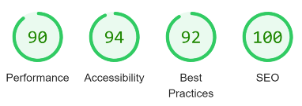

# Testing

### Contents
- [Testing Stories for UX](#testing-user-stories-from-the-user-experience-ux-section)
- [Validator Testing](#validator-testing)
  * [HTML](#html)
  * [CSS](#css)
  * [Javascript](#javascript)
  * [Lighthouse](#lighthouse)
  * [WAVE accessibility tool](#wave-accessibility-evaluation-tool)
- [Browser Testing](#browser-testing)
- [Device Testing](#device-testing)
  * [Mobile](#mobile)
- [Manual Testing](#manual-testing)
- [Automated Testing](#automated-testing)
- [Bugs](#bugs)
  * [Fixed Bugs](#fixed-bugs)
  * [Unfixed Bugs](#unfixed-bugs)

 

*Please note: To open any external links in a new browser tab, please press **CTRL + Click***

***

## Testing User Stories from the User Experience (UX) Section

### EPIC | *Navigation*
 

*[As a User, I can access a navigation bar on every page so that I can easily view desired content](https://github.com/chris-townsend/where-next/issues/1)*

**Logged out Navigation** 

**Logged in Navigation**

*[As a User, I would like to use the app on my mobile, so that I don't have to rely on having my laptop/desktop with me](https://github.com/chris-townsend/where-next/issues/29)*

#

### EPIC | *User Account Mangement*
 

*[As a User, I can register for an account so that I can gain access to all the features that are available exclusively to registered users](https://github.com/chris-townsend/where-next/issues/2)*

*[As a User, I can log into my account so that I can access functionality for logged in users](https://github.com/chris-townsend/where-next/issues/6)*

*[As a User, I can safely log out of my account so that I can disconnect from the site](https://github.com/chris-townsend/where-next/issues/7)*

*[As a logged-in User, I can see my login status so that I know if I am logged in or out of my account](https://github.com/chris-townsend/where-next/issues/8)*

*[As a logged-in User, I can change my password so that I can keep my account secure](https://github.com/chris-townsend/where-next/issues/11)*

#

### EPIC | *Posts*
 

*[As a user, I can view posts, without having to sign-up to enjoy the site's content](https://github.com/chris-townsend/where-next/issues/4)*

*[As a logged-in User, I can create posts so that I can add content to the site](https://github.com/chris-townsend/where-next/issues/5)*

*[As a logged-in User, I can edit my post so that I can fix or update my existing content](https://github.com/chris-townsend/where-next/issues/12)*

*[As a logged in User, I would like the ability to delete posts so that I can remove any post that I don't want to share](https://github.com/chris-townsend/where-next/issues/13)*

*[As a logged-in User, I want to express my appreciation for posts that interest me by liking them, so that I can engage with the content and show support for the author](https://github.com/chris-townsend/where-next/issues/20)*

*[As a User, I would like to see the newest posts at the top, ordered by most recently created so that I am up to date with the latest content](https://github.com/chris-townsend/where-next/issues/25)*

#

### EPIC | *Comments*
 

*[As a User, I can view comments on posts so that I can read other user's feedback](https://github.com/chris-townsend/where-next/issues/9)*

*[As a logged-in User, I want to be able to leave comments on a post, so that I can express my opinions or ideas related to the post](https://github.com/chris-townsend/where-next/issues/18)*

*[As a logged-in User who is the owner of the comment, I can update my comment so that I can fix any mistakes](https://github.com/chris-townsend/where-next/issues/22)*

*[As a logged-in User who is the owner of the comment, I can delete my comment so that I can remove any unwanted comments from the site](https://github.com/chris-townsend/where-next/issues/23)*

*[As a User, I can see the date of when the comment has been published so that I know how old the comment is](https://github.com/chris-townsend/where-next/issues/27)*

#

### EPIC | *Features*
 

*[As a User, I can view other user's profiles so that I can see their bio and learn more about them](https://github.com/chris-townsend/where-next/issues/14)*

*[As a logged-in User, I can customise my profile with an avatar so that my profile is easy to identify within the site](https://github.com/chris-townsend/where-next/issues/15)*

*[As a logged-in User, I would like the ability to update my profile so that I can keep my information up to date](https://github.com/chris-townsend/where-next/issues/16)*

*[As a logged-in User, I would like the ability to follow/unfollow users so I can keep track of their content and revisit their profiles easily](https://github.com/chris-townsend/where-next/issues/17)*

*[As a logged-in User, I can save a post to a personal list so that I can easily return to it later](https://github.com/chris-townsend/where-next/issues/19)*

*[As a User, I can search for posts or profiles by keyword so that I can find what I'm looking for more efficiently](https://github.com/chris-townsend/where-next/issues/21)*

*[As a User, I can keep scrolling through my feed of posts which load automatically, so that I don't have to change pages](https://github.com/chris-townsend/where-next/issues/26)*

*[As a User, I can contact the site owner so that I can request any information that I might need](https://github.com/chris-townsend/where-next/issues/28)*

*[As a Site owner, I can add a favicon so that the site looks more distinguishable](https://github.com/chris-townsend/where-next/issues/30)*

#

### EPIC | *Groups*
 

*[As a User, I want to be able to create a new group so that I can connect with people who share my interests and plan trips together](https://github.com/chris-townsend/where-next/issues/42)*

*[As a User, I want to be able to leave a group if it no longer aligns with my interests or travel plans so that I can focus on other groups that better suit my needs](https://github.com/chris-townsend/where-next/issues/43)*

*[As a User, I want to be able to see a list of members in a group so that I can get to know other people and connect with them](https://github.com/chris-townsend/where-next/issues/41)*

#

[Back to top ⇧](#contents)

***

## Validator Testing

### HTML

| Page                   | Status           | URL       |
| ---                    |   :---:          |  :---:    |
|`index.html`            |   *pass*     | *[result](https://validator.w3.org/nu/?doc=https%3A%2F%2Fwhere-next-social.herokuapp.com%2F)*  |  

The *[W3C HTML validator](https://validator.w3.org/)* was used to test the one HTML file and **no errors** were reported in the final deployment.

***

### CSS 

The *[W3C CSS Validator](https://jigsaw.w3.org/css-validator/)* was used to validate the project, the results are shown below with **no errors reported.**

- *[ CSS results](https://jigsaw.w3.org/css-validator/validator?uri=https%3A%2F%2Fwhere-next-social.herokuapp.com%2F&profile=css3svg&usermedium=all&warning=1&vextwarning=&lang=en)*

***

### JavaScript

*[JSHint](https://jshint.com/)* was used to check the JavaScript within the application, the results are shown below with all pages passing and **no errors reported.**

| Folder        |     Page                      | Status        |              
|  :---:        |     :---:                     |   :---:       |  
|**Components** |                               |               |  
|               |`Asset.js`                     |  **pass**     |
|               |`Avatar.js`                    |  **pass**     |
|               |`NavigationBar.js`             |  **pass**     |
|               |`PostDropdownBar.js`           |  **pass**     |
|               |`ProfileDropdownBar.js`        |  **pass**     |
|               |`SideNavigationBar.js`         |  **pass**     |
|**Contexts**   |                                               |
|               |`CurrentUserContext.js`        |  **pass**     |
|               |`ProfileDataContext.js`        |  **pass**     |
|**Hooks**      |                                               |
|               |`UseRedirect.js`               |  **pass**     |
|**Pages**      |                                               |
|  *auth*       |`SignInForm.js`                |  **pass**     |
|               |`SignUpForm.js`                |  **pass**     |
| *comments*    |`Comment.js`                   |  **pass**     |
|               |`CommentCreateForm.js`         |  **pass**     |
|               |`CommentEditForm.js`           |  **pass**     |
| *contact*     |`ContactCreateForm.js`         |  **pass**     |
| *groups*      |`Group.js`                     |  **pass**     |
|               |`GroupCreateForm.js`           |  **pass**     |
|               |`GroupDetail.js`               |  **pass**     |
|               |`GroupList.js`                 |  **pass**     |
| *posts*       |`Post.js`                      |  **pass**     |
|               |`PostCreateForm.js`            |  **pass**     |
|               |`PostEditForm.js`              |  **pass**     |
|               |`PostPage.js`                  |  **pass**     |
|               |`PostsPage.js`                 |  **pass**     |
| *profiles*    |`PasswordEditForm.js`          |  **pass**     |
|               |`PopularProfiles.js`           |  **pass**     |
|               |`Profile.js`                   |  **pass**     |
|               |`ProfileEditForm.js`           |  **pass**     |
|               |`ProfilePage.js`               |  **pass**     |
|               |`UsernameEditForm.js`          |  **pass**     |
| **Utils**     |                                               |
|               |`Utils.js`                     |  **pass**     |
| **src**       |                               |               |
|               |`App.js`                       |  **pass**     |
|               |`index.js`                     |  **pass**     |

***

### Lighthouse 

I have run the website through Google Chrome's Lighthouse audit application and the results are shown below:
 
| Page                     |    Desktop     |    Mobile    | 
| ---                      |      :---:     |    :---:     | 
| Home page                |   
| `SignInForm.js`               |                      |                      |   
| `SignUpForm.js`          |                      |                      |
| `PostsPage.js`               |                      |              | 
| `PostCreateForm.js`               |                      |              | 
| `PostEditForm.js`               |                      |              | 
| `GroupList.js`        |         |          |
| `GroupCreateForm.js` |   |                                            |
| `GroupDetail.js`|  |                                              |
| `ContactCreateForm.js`|  |                                              |
| `ProfilePage.js`|  |                                              |

 

***

### WAVE accessibility evaluation tool

Most pages of the site were tested through the [WAVE evaluation tool](https://wave.webaim.org/), The results are documented as images in the [`docs/testing/accessibility/`]() directory.

  

[Back to top ⇧](#contents)

***

## Browser Testing

The Website was tested on Google Chrome, Internet Explorer and Microsoft Edge with no issues reported. Family members and friends were asked to review the site and point out any bugs or problems if encountered.

***

## Device Testing

The website has been viewed on a variety of devices such as Desktop, Laptop, iPad, Oneplus 5t & Samsung Galaxy S21 to ensure that the responsive design worked as intended. [Chrome DevTools](https://developer.chrome.com/docs/devtools/) was used to test the responsiveness on different devices.

### Mobile 

All pages have been tested through Google's [Mobile friendly test](https://search.google.com/test/mobile-friendly), the results are displayed below:

| Page                     |    Result      |  URL    |
| ---                      |      :---:     |   :---: |
| ` `               |    *pass*      |    -    |
| ` `               |    *pass*      |    -    |

***

## Manual Testing

The process and outcomes of manual testing are described in depth in the following section:

### *Navigation*
 

| Page/Status     | Element             |   Action    | Expected Result           | Pass/Fail   |
| ---             | ---                 |   :---:     |    :---:                  |    :---:    |
|**Homepage**     |**Navbar**           |             |                           |             |
|                 |*Information icon*   |   *hover*   | *Display 'Information'*   |  **pass**   |
|                  |                      |  *click*   | *Open information pop up modal*   |  **pass**   |
|                 |*WHERE NEXT Logo*    |   *click*   | *Redirect to homepage*    |  **pass**   |
| **logged out**  |*Sign-in link*       |   *click*   | *Open `SignInForm.js` page* |  **pass**   |
|                 |*Sign-up link*       |   *click*   | *Open `SignUpForm.js` page*  |  **pass**   |
| **logged in**   |*Avatar with Profile*|  *display*  | *Display the current users Avatar*|**pass**|
|                 |                     |   *hover*   | *'Profile' text changes colour* | **pass** |
|                 |                     |   *click*   | *Go to current users profile page*| **pass**|
|                 |*Home link*    |   *click*         | *Redirect to homepage*  |  **pass**   |
|                 |*Feed link*    |   *click*         | *Display Feed page of posts from followed users*  |  **pass**   |
|                 |*Add Post link* |   *click*   | *Open `PostCreateForm.js` page*|**pass**|
|                 |*Bookmarks link*        |   *click*   | *Display a page of posts which has been bookmarked by the current user*      |  **pass**   |
|                 | *Groups link*       |  *click*    | *Open `GroupList.js`*             | **pass** |
|                 | *Liked link*        |  *click*    | *Display a page of liked posts from the current user  | **pass**  |
|                 | *Contact link*      |  *click*   | *Open `ContactCreateForm.js`*   | **pass**
|                 | *Sign Out link*     |  *click*   | *Open sign out confirmation modal*  | **pass** |      
|                 |*All nav headings*   |   *hover*  |*Display black text & lighter icon colour*| **pass** |

### *Posts Component*
 

| Page/Status     | Element             |   Action    | Expected Result           | Pass/Fail   |
| ---             | ---                 |   :---:     |    :---:                  |    :---:    |
|**Homepage**     | *Search bar*        |  *hover*    |*Search icon changes colour*  |  **pass**   |
|                 |           | *type keyword* | *Loading spinner displayed until results* | **pass** |
|                 |                     | *no-results* | *Display no results image with text* | **pass**|
|**logged-out**   | **Post Component**  |             |                                       |         |
|                 | *Post header*       | *display*   | *Post owner avatar & 'profile' text* | **pass** |
|                 |                     | *display*   | *Post date*                | **pass**|
|                 | *Avatar*            | *click*     | *Profile page of the post owner* | **pass**|
|                 |                     | *hover*     | *text changes colour on 'profile' text* | **pass**|
|                 | *Main post image*   | *hover*    | *pointer cursor*                       | **pass**|
|                 |                     | *click*    |  *Redirct to post detail page*    | **pass**  |
|                 | *Heart Icon*        | *hover*     |*Display 'Log in to like posts' text* | **pass**|
|                 | *Comment Icon*      | *hover*     |*Display 'View Comments' text*      | **pass** |
|                 |                     | *click*     | *Redirect to post detail page* | **pass**  |
|                 | *Groups Icon*       | *hover*     | *Display 'Log in to create and join groups` text*|**pass**|
|                 | *Bookmark Icon*     | *hover*     | *Display 'Please login to bookmark posts'*|**pass**|
|**Post Detail page**| **Comments section**|          |                                     |           |
|                    |                   | *display*  | *Avatar*    |**pass** |
|                    |                    | *click*   | *Redirct to comment owners profile* | **pass** |
|                    |                   | *display*  | *Comment date* | **pass**  |
|                    |        | *no comments* |   *Display no comments message* | **pass** |
| **logged-in**      | **Post Component**|            |                              |                |
|                    | *Heart Icon*      | *hover*   | *If the currently logged in user is the owner of the post display 'Sorry, you can't like your own posts' text* | **pass** |
|                    |                   | *hover*     |  *Display 'Click to like post' text if the logged in user is not the owner of the post* | **pass** |
|                    |                   | *click*     | *Post saved to 'Liked' list* | **pass**  |
|                    |                   |             | *Success notification - 'Post liked'* | **pass** |
|                    | *Solid heart Icon* | *click*     | *Post removed from 'Liked' list* | **pass** |
|                    |                    |             | *Notification - 'Post Unliked'*  | **pass**  |
|                    | *Groups Icon*| *hover*   | *Display 'Add a group from the groups tab' text*|**pass**|
|                    | *Bookmark Icon* | *hover* | *If the currently logged in user is the owner of the post display 'You can't bookmark your own post' text* | **pass** |
|                    |                   | *hover*    | *Display 'Click to save post' text if the logged in user is not the owner of the post* | **pass** |
|                    |                  | *click*    | *Post saved to 'Bookmarks' list* | **pass**   |
|                    |                  |            | *Success notification - 'Post saved'* | **pass** |
|                    | *Solid bookmark Icon* |*click* | *Post removed from 'Bookmarks' list* | **pass** |
|                    |                       |        | *Notification - 'Post removed'* | **pass** |
| **post-owner**     |  *Edit/Delete menu*   | *display* | *If the user is the owner of the post display edit/delete menu* | **pass** |
|                    |                      | *hover*  |  *Pointer cursor* | **pass** |
|                    |   *Edit icon*        | *hover*  | *Add background colour*  | **pass** |
|                    |                      | *click*  | *Redirect to post edit page* | **pass** |
|                    | *Delete icon*         | *hover*   | *Add background colour* | **pass** |
|                    |                       | *click*   | *Post removed from database* | **pass** |
|                    |                       |           | *Notification - 'Post removed'* | **pass** |

### *Add/Edit Post*
 

| Page/Status     | Element             |   Action    | Expected Result           | Pass/Fail   |
| ---             | ---                 |   :---:     |    :---:                  |    :---:    |
|**Add Post page**|                     |             |                           |              |
|                 | *Add image*         | *click*     | *Opens your computer to select an image*| **pass**|
|               | *Image selected* |  *display*  | *Selected image with a button to change image* |**pass**|
|               |*Change image button*  |  *hover*    | *Change colour*           |   **pass** |
|               |                       |  *click*    | *Opens your computer to select a new image*| **pass**|
|               | *Title*                |   *check*   | *Title must be under 200 characters* | **pass** |
|               |                        |             | *Field must not be empty* | **pass**
|               | *Cancel button*        |  *hover*    |  *Change colour*           |  **pass** |
|               |                        |  *click*    | *Redirect to homepage*   | **pass**     |
|               | *Create button*        |  *hover*    | *Change colour*           | **pass**    |
|               |                    |  *click*    | *With valid data - direct to new post page*| **pass**|
|               |                     |      | *All fields required else error notification & specified error on input field*       | **pass** |
|               |                       |    | *Success notifcation of a newly created post*|**pass**|
|**Edit Post page**| *Image*      | *display*    | *Prepopulated image with 'Change Image' button*| **pass**|
|                  | *Change image button* | *hover* | *Change colour* | **pass** |
|                  |                       | *click* | *Opens your computer to select a new image* | **pass**|
|          | *Image selected* | *display* | *New image is displayed to upload* | **pass**  |      
|                  | *Title/Content*      | *display* | *Prepopulated data* | **pass**    |
|             | *Cancel button*      | *hover* | *Change colour*     | **pass**    |
|             |                      | *click* | *Redirect to post detail page* | **pass**    |
|             | *Update button*      | *hover* |  *Change colour*    | **pass** |
|             |                      | *click* | *With valid data - direct to updated post page*|**pass**|
|             |                      |         | *Notification of updated post*  | **pass**|
|             |                      | *empty field* | *Error notification & specified error on input field* | **pass**|

### *Auth pages*
 

| Page/Status     | Element             |   Action    | Expected Result           | Pass/Fail   |
| ---             | ---                 |   :---:     |    :---:                  |    :---:    |
|**Sign up page**| *Username input box* |   *click*   | *Clicking the username input box allows the user to input alphanumeric characters* | **pass**  |
|                 |*Password input box* | *click* | *Clicking the password input box allows the user to input alphanumeric characters* | **pass**  |
|                 |*Confirm password input box* | *display* | *Clicking the confirm password input box allows the user to input alphanumeric characters* | **pass**|
|                 | *Sign up button*    | *hover* | *Change colour* | **pass** | 
|                  |                     |*click*  | *If valid data - signup user and redirect to sign-in page* | **pass** |
|                  |                    | *username-taken* | *Display error message* | **pass**|
|                  |                     | *username field blank* | *Display error message* | **pass** | 
|                  |                     |*password field blank* | *Display error message* | **pass** |
|                  |                     |         |*Success notification* | **pass**  |
|                 | *Sign-in link*       | *hover* | *Change colour* | **pass** |
|                 |                      | *click* | *Redirect to sign-in page* | **pass** |
|**Sign in page**| *Username input box* | *click*| *Clicking the username input box allows the user to input alphanumeric characters* | **pass** |
|                | *Password input box* | *click* | *Clicking the password input box allows the user to input alphanumeric characters* | **pass**|
|                | *Sign in button* | *hover* | *Change colour* | **pass** |
|                |     | *click* | *If valid data - signin user and redirect to the home page* | **pass** |      
|                |                  |*username field blank* | *Display error notification & message* | **pass** |
|                |                  |*password field blank* | *Display error notifcation & message* | **pass** |
|                | *Sign-up link* | *hover* | *Change colour* | **pass** | 
|                |                | *click* | *Redirect to sign-up page* | **pass** | 
| **Sign out tab/modal** |              | *click* | *Open sign out confirmation modal* | **pass** |
|                | *Modal*        | *click outside box* | *Close modal* | **pass** |
|                |                | *click modal close button* | *Close modal* | **pass** | 
|                | *Cancel button*| *hover* | *Change colour* | **pass**|
|                |                | *click* | *Return to homepage* | **pass** |
|                | *Sign out button* | *hover* | *Change colour* | **pass** | 
|                |                 | *click*   | *Log user out & return to homepage* |**pass**| 
|                |                 |           | *Notification of successful logout* | **pass**| 

### *Groups*
 

| Page/Status     | Element             |   Action    | Expected Result           | Pass/Fail   |
| ---             | ---                 |   :---:     |    :---:                  |    :---:    |
|**GroupList.js** |                     |             |                           |             | 
|                 |*Create group button*| *display*   | *Create group button*   | **pass**  |
|                 |                     | *hover*     | *Light background/Dark text*| **pass** |
|                 |                     | *click*     | *Redirect to `GroupCreateForm.js`* | **pass** |
|                 | *Groups*            | *display*   | *A list of user created groups*|**pass** |
|                 |                     | *display*   | *If the user is the owner of the group, display 'Delete group' button* | **pass** |
|                 |                     | *display*  | *If the user is not the owner of the group, display 'View group' button* | **pass** |
|                 | *Group title*       | *hover*    | *Darker text* | **pass** | 
|                 |                     | *click*    | *Redirect to `GroupDetail.js`* | **pass** | 
|                 |  *View group button*   | *hover*    | *Light background/Dark text* | **pass**| 
|                 |                     | *click*    | *Redirct to `GroupDetail.js`*| **pass** |
|                 |  *Delete group button* | *hover* | *Light background/Dark text* | **pass** |
|                 |                        | *click* | *Remove group from the database*| **pass**|
|                 |                        |         | *Notification of removing group* | **pass** | 
|**GroupCreateForm.js**|*Group Name input field*| *click* | *Clicking the group name input box allows the user to input alphanumeric characters*| **pass** |
|                 |*Description input box* | *click* | *Clicking the description input box allows the user to input alphanumeric characters* | **pass**  |     
|                | *Cancel button*        | *hover* | *Light background/Dark text* | **pass** | 
|                |                        | *click* | *Redirect to `GroupList.js`*| **pass** |
|                | *Create button*        | *hover* | *Light background/Dark text* | **pass** |
|                |                        | *click* | *Empty field - Display error notification & specified error on input field* | **pass** | 
|                |                        |         | *If valid title, form will submit & redirect user to new `GroupDetail.js` page* | **pass** | 
|**GroupDetail.js**|                   |   *display* | *Group title, description and members of the group*| **pass** |
|                  | *Members field*   | *display*  | *Avatar for a member of the group* | **pass** |
|                  |                   | *display*  | *If no members, display no members text*| **pass**|
|                  | *Join group button* | *hover* | *Light background/ Dark text* | **pass** |  
|                  |                    | *click*  | *User joins group/ added as a member to the database* | **pass** |
|                  |                    |          | *Success notification* | **pass** |
|                  |                    |          | *User avatar updates in members section* | *Fail/ **pass** on page refresh*|
|                  |*Leave group button*| *hover* | *Light background/ Dark text* | **pass** |
|                  |                    | *click* | *User removed from group/database* | **pass** |
|                  |                    |         | *Notification of left group*       | **pass** |
|                  |                    |         | *User avatar removed from members section* | *Fail/ **pass** on page refresh*|

### *Contact*
 
| Page/Status     | Element             |   Action    | Expected Result           | Pass/Fail   |
| ---             | ---                 |   :---:     |    :---:                  |    :---:    |

### *Profiles*
 
| Page/Status     | Element             |   Action    | Expected Result           | Pass/Fail   |
| ---             | ---                 |   :---:     |    :---:                  |    :---:    |

***

## Automated Testing

Several unit tests were written to test 

 **
Coverage report
**

 

*Coverage report generated from* [*Coverage.py*](https://coverage.readthedocs.io/en/7.1.0/)

***

## Bugs

Issues were created on GitHub and noted with a `bug` label.
 

### Fixed Bugs

1. [Unable to type in the username field during sign-up](https://github.com/chris-townsend/where-next/issues/31)

*resolved - [01e48b6](https://github.com/chris-townsend/where-next/commit/01e48b69c7bc08e243ead0f29a928919ec769f6d) missing name field within `<Form.Control`*

`name="username"`

2. [Unable to see information about a post in the console](https://github.com/chris-townsend/where-next/issues/32)

*resolved - [70f350a](https://github.com/chris-townsend/where-next/commit/70f350a17fa195b11ada98f0996a13ab062072ca)*

3. [Posts not listed until a key is typed into the search bar](https://github.com/chris-townsend/where-next/issues/33)

*resolved - [8376d42](https://github.com/chris-townsend/where-next/commit/8376d42f0ec4ecd4156538ffca087cf183b0d130)*

4. [Comment only removed after page refresh](https://github.com/chris-townsend/where-next/issues/34)

*resolved - [eeabc7b](https://github.com/chris-townsend/where-next/commit/eeabc7b837f0de8d6d21682491ac0c6595e3cf09)*

5. [Unable to follow a user from the 'Most followed' section](https://github.com/chris-townsend/where-next/issues/35)

*resolved - [5abde3d](https://github.com/chris-townsend/where-next/issues/35)*

6. [When a user updates their avatar image, all user avatar images are changed](https://github.com/chris-townsend/where-next/issues/36)

*resolved - [73770b9](https://github.com/chris-townsend/where-next/commit/73770b9eb4723f70e7882edb152d9bfbdbff0d0f)*

7. [Profile Image is not being displayed on ProfilePage.js](https://github.com/chris-townsend/where-next/issues/37)

*resolved - [8a3c508](https://github.com/chris-townsend/where-next/commit/8a3c508e99d323b1853c446d948bae0a1082bf8a)*

8. [Contact form returns a 403 error when the form is submitted](https://github.com/chris-townsend/where-next/issues/38)

*resolved - [8415f53](https://github.com/chris-townsend/where-next/commit/8415f533c46930873b9ca207685f5cf42b705f25)*

9. [Unable to update profile information](https://github.com/chris-townsend/where-next/issues/39)

*resolved - [5d46312](https://github.com/chris-townsend/where-next/commit/5d4631206020a4886c413609b4c0722984fcbbbb)*

10. [Join/Leave a group only after page refresh](https://github.com/chris-townsend/where-next/issues/40)

*resolved - [b8a7672](https://github.com/chris-townsend/where-next/commit/b8a767256b56ed652e1a12256f91f20c49e40aad)*

#

### Unfixed Bugs

1. 
 
 

[Back to top ⇧](#contents)

[Back to *README.md*](/README.md#testing)

***